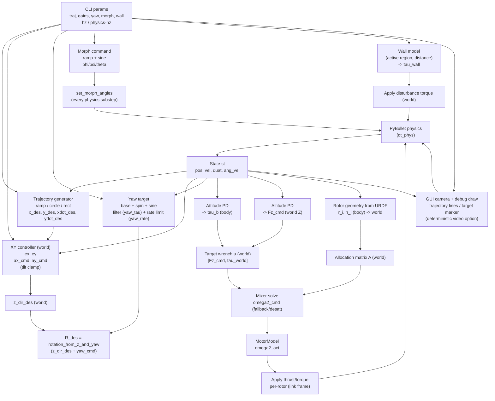
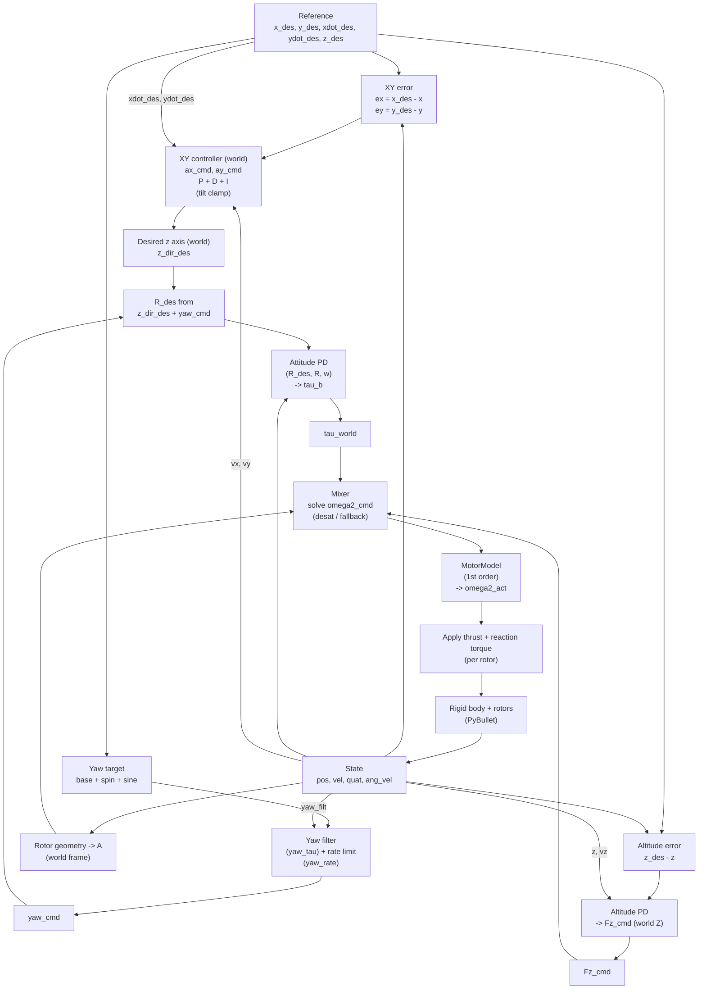

## demo_06_wall_effect 制御系（概略）

以下のMermaid図は `sim/demo/demo_06_wall_effect.py` の制御ループ構造を「信号の流れ」と「更新周期（制御 dt / 物理 dt_phys）」の観点でまとめたものです。

## demo_06_wall_effect 制御器ブロック図（誤差 -> 指令 -> 推力 -> 機体 -> フィードバック）

「軌道追従・姿勢・高度・ヨー」の**制御器としての中身**だけを抜き出した図です（壁外乱やカメラ描画などは除外）。

